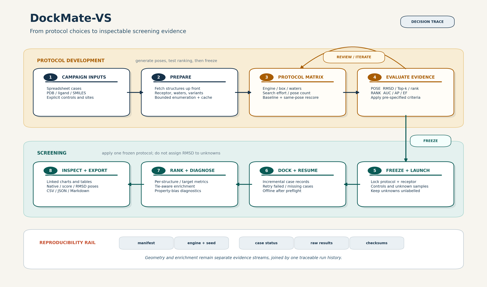

# DockMate-VS

[](https://github.com/gkoorsen/DockMate-VS/actions/workflows/tests.yml)
[](LICENSE)

DockMate-VS is a spreadsheet-driven desktop application for developing,
recording, and applying molecular-docking protocols. It keeps native-pose
recovery, active/inactive enrichment, and score-only screening as separate
questions while producing resumable, machine-readable campaigns.



## Why use it?

- Sweep docking engine, box definition, water handling, exhaustiveness, random
  seed, and rescoring conditions before committing to a screen.
- Compare baseline and Smina score-only rankings on the same saved poses.
- Calculate symmetry-aware heavy-atom RMSD without superimposing a displaced
  docking pose onto its native ligand.
- Evaluate labelled controls per receptor structure and target while keeping
  unlabelled compounds out of enrichment statistics.
- Resume compatible campaigns and retry missing or failed outputs.
- Inspect native, best-score, and best-RMSD poses and export CSV, JSON, Markdown,
  charts, and viewer files.

## Installation

Python 3.9-3.12 is supported. A conda environment is recommended because RDKit
and optional protein-preparation tools have compiled dependencies.

```bash
git clone https://github.com/gkoorsen/DockMate-VS.git
cd DockMate-VS
conda env create -f environment.yml
conda activate dockmate-vs
python -m pip install -e .
```

Install the package-manageable docking and preparation programs into the active
environment with:

```bash
scripts/install_external_tools.sh
```

Conda activation automatically places these executables on `PATH`. The script
automatically prefers Micromamba or Mamba over Conda for dependency resolution.
On macOS, install Micromamba with `brew install micromamba` if Conda is using its
slow classic solver. The script can also register existing Smina, rDock, PyMOL,
and separately licensed LigPlot+ installations; run
`scripts/install_external_tools.sh --help` for those options.

Alternatively, install into an existing compatible environment:

```bash
python -m pip install .
```

For local execution, AutoDock Vina or Smina must be selected in the GUI or
discoverable in the executable `PATH`; Open Babel's `obabel` command must be on
that `PATH`. rDock, Meeko flexible-receptor preparation, PyMOL, and LigPlot+ are
optional. Protein repair uses OpenMM/PDBFixer, Reduce, and PROPKA when available. See
[`USER_GUIDE.md`](USER_GUIDE.md) for platform-specific setup and capability
details.

### Optional core container

The core Docker image provides a reproducible headless environment containing
DockMate-VS, Vina, Smina, rDock, Open Babel, fpocket, OpenMM, and PDBFixer:

```bash
scripts/dockmate-docker build
scripts/dockmate-docker doctor
scripts/dockmate-docker protocol examples/campaign.protocol.yml
```

The native GUI can select **Docker** as its execution backend while keeping
results and the PyMOL/LigPlot+ launchers on the host. PyMOL and LigPlot+ are not
redistributed in the image; see [`THIRD_PARTY_NOTICES.md`](THIRD_PARTY_NOTICES.md).
The current image targets `linux/amd64` because the available Smina package is
not published for every architecture.

## Launch

```bash
dockmate-vs
```

or, from a source checkout:

```bash
python scripts/launch_dockmate_vs.py
```

Headless campaigns use YAML or JSON configuration files:

```bash
dockmate-vs protocol --config examples/campaign.protocol.yml
dockmate-vs screen --config examples/campaign.screen.yml
dockmate-vs report --run results/dude_aces_screen
dockmate-vs doctor
```

## First reproducible example

1. Open the **Protocol Development** tab.
2. Select `examples/dude_aces_protocol_development_1E66.xlsx`.
3. Use the settings in `examples/campaign.protocol.yml`, or run that campaign
   directly with the headless command shown above.
4. Select a clean output directory and start the run.
5. Review best-pose, Top-1/5/10, best-pose-rank, rescoring, factor effects, and
   the near-equivalent pose-recovery candidate set.

The protocol workbook contains the public DUD-E ACES 1E66/HUX native-pose
control. A successful run writes a protocol manifest, condition-level CSV,
Markdown summary, machine-readable candidate protocols, and interactive charts
below the selected output directory. Compare qualified candidates in separate
labelled enrichment runs and freeze one protocol before screening unknowns.

For enrichment, select
`examples/dude_aces_screening_subset_1E66_seed42.xlsx` in the **Screening** tab
or run `dockmate-vs screen --config examples/campaign.screen.yml`. It contains a
fixed, score-independent subset of 20 DUD-E clustered actives and 200 DUD-E
property-matched decoys at one receptor. Matched decoys are presumed
non-binders, not experimentally confirmed inactives. This compact campaign
demonstrates the complete workflow rather than establishing a new scoring-
function benchmark. Exact scores and poses can vary with docking-engine and
preparation-tool builds, hardware, and random seed. See `examples/README.md` for
source checksums, reconstruction, and interpretation guidance.

## Input models

The application accepts two complementary labelled-data models:

- **Matched controls:** one row contains a PDB/native-ligand pair and optional
  decoy name/SMILES. The row expands to one active and one decoy docking.
- **Assay benchmark:** each row contains one compound SMILES and an explicit
  `label` (`1` active, `0` inactive). Multiple actives and inactives can share a
  receptor structure.

A row without a decoy and without an explicit label is an unlabelled screening
sample. It is ranked but never enters ROC AUC or enrichment calculations.
SMILES columns are detected automatically. The **Filters** tab can exclude known
additives/cofactors and optionally sample unlabelled screening compounds; all
labelled or matched controls are always retained.

## Outputs

Each screening run writes:

- `run_manifest.json`: settings, cases, code revision, dependency versions, and
  external docking-tool versions.
- `redock_progress.json`: incremental state used for compatible restart.
- `redock_results.csv` and `redock_results.json`: case-level scores, status,
  preparation descriptors, pose metrics where applicable, and provenance.
- `redock_summary.json` and `redock_summary.md`: structured and human-readable
  summaries regenerated from raw result records.

Protocol-development runs produce an analogous manifest, condition-level CSV,
summary, recommendations, and plots.

The component boundaries, campaign flow, output contracts, and extension points
are described in [`docs/architecture.md`](docs/architecture.md).

## Testing

```bash
python -m pip install -e ".[test]"
python -m pytest dockmate_vs/tests -q
```

GitHub Actions runs the focused suite on Python 3.9, 3.11, and 3.12 under Linux.
External docking binaries are mocked in automated integration tests. Before a
release, maintainers also verify the documented example with an installed
docking engine and record the engine version in the generated manifest.

## Interpretation and limitations

The platform orchestrates established docking engines; it does not introduce a
new scoring function. A recoverable native-like pose does not imply that the
engine ranks it first, and enrichment does not establish biochemical activity.
Raw scores should normally be compared within one receptor structure. Standard
Vina/Smina workflows are not valid for covalently linked complexes, which are
detected and skipped.

See [`USER_GUIDE.md`](USER_GUIDE.md) for complete workflow instructions,
troubleshooting, and results interpretation.

## Citation and support

Citation metadata are provided in [`CITATION.cff`](CITATION.cff). Until the
SoftwareX article and archived release DOI are available, cite the versioned
GitHub release and repository URL.

- Problems and feature requests: [GitHub Issues](https://github.com/gkoorsen/DockMate-VS/issues)
- Support contact: [gkoorsen@uj.ac.za](mailto:gkoorsen@uj.ac.za)
- Contribution guide: [`CONTRIBUTING.md`](CONTRIBUTING.md)
- Release history: [`CHANGELOG.md`](CHANGELOG.md)

## License

DockMate-VS is distributed under the [MIT License](LICENSE). External
programs and benchmark datasets retain their own licenses and terms.
