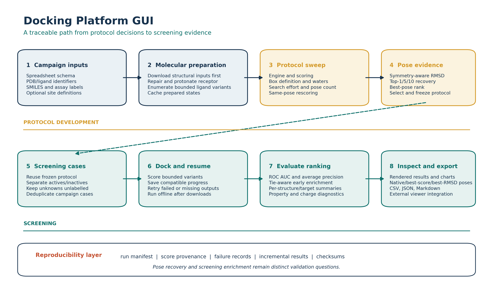

# Docking Platform GUI

[](https://github.com/gkoorsen/docking_platform_gui/actions/workflows/tests.yml)
[](LICENSE)

Docking Platform GUI is a spreadsheet-driven desktop application for developing,
recording, and applying molecular-docking protocols. It keeps native-pose
recovery, active/inactive enrichment, and score-only screening as separate
questions while producing resumable, machine-readable campaigns.



## Why use it?

- Sweep docking engine, box definition, water handling, exhaustiveness, random
  seed, and rescoring conditions before committing to a screen.
- Compare baseline and Smina score-only rankings on the same saved poses.
- Calculate symmetry-aware heavy-atom RMSD without superimposing a displaced
  docking pose onto its native ligand.
- Evaluate labelled controls per receptor structure and target while keeping
  unlabelled compounds out of enrichment statistics.
- Resume compatible campaigns and retry missing or failed outputs.
- Inspect native, best-score, and best-RMSD poses and export CSV, JSON, Markdown,
  charts, and viewer files.

## Installation

Python 3.9-3.12 is supported. A conda environment is recommended because RDKit
and optional protein-preparation tools have compiled dependencies.

```bash
git clone https://github.com/gkoorsen/docking_platform_gui.git
cd docking_platform_gui
conda env create -f environment.yml
conda activate docking-platform-gui
pip install -e ".[test]"
```

Alternatively, install into an existing compatible environment:

```bash
python -m pip install -e ".[test]"
```

AutoDock Vina or Smina must be installed separately and its executable selected
in the GUI. rDock, Open Babel, PyMOL, and LigPlot+ are optional. Protein repair
uses OpenMM/PDBFixer, Reduce, and PROPKA when available. See
[`USER_GUIDE.md`](USER_GUIDE.md) for platform-specific setup and capability
details.

## Launch

```bash
redock-gui
```

or, from a source checkout:

```bash
python scripts/launch_redock_analysis_gui.py
```

## First reproducible example

1. Open the **Protocol Development** tab.
2. Select `examples/esr1_protocol_development_1XP1.xlsx`.
3. Choose Vina, a 6 A co-crystal margin, retained waters, exhaustiveness 8,
   20 modes, and seed 42.
4. Select a clean output directory and start the run.
5. Review best-pose, Top-1/5/10, and best-pose-rank results.

The workbook contains one public PDB/native-ligand pair and downloads the
structural input before docking. It contains no redistributed LIT-PCBA assay
compounds.

## Input models

The application accepts two complementary labelled-data models:

- **Matched controls:** one row contains a PDB/native-ligand pair and optional
  decoy name/SMILES. The row expands to one active and one decoy docking.
- **Assay benchmark:** each row contains one compound SMILES and an explicit
  `label` (`1` active, `0` inactive). Multiple actives and inactives can share a
  receptor structure.

A row without a decoy and without an explicit label is an unlabelled screening
sample. It is ranked but never enters ROC AUC or enrichment calculations.

## Outputs

Each screening run writes:

- `run_manifest.json`: settings, cases, code revision, dependency versions, and
  external docking-tool versions.
- `redock_progress.json`: incremental state used for compatible restart.
- `redock_results.csv` and `redock_results.json`: case-level scores, status,
  preparation descriptors, pose metrics where applicable, and provenance.
- `redock_summary.json` and `redock_summary.md`: structured and human-readable
  summaries regenerated from raw result records.

Protocol-development runs produce an analogous manifest, condition-level CSV,
summary, recommendations, and plots.

## Testing

```bash
python -m pytest docking_platform_gui/tests -q
```

GitHub Actions runs the focused suite on Python 3.9, 3.11, and 3.12 under Linux.
External docking binaries are mocked in automated integration tests; release
verification additionally uses real Vina/Smina smoke runs.

## Interpretation and limitations

The platform orchestrates established docking engines; it does not introduce a
new scoring function. A recoverable native-like pose does not imply that the
engine ranks it first, and enrichment does not establish biochemical activity.
Raw scores should normally be compared within one receptor structure. Standard
Vina/Smina workflows are not valid for covalently linked complexes, which are
detected and skipped.

See [`USER_GUIDE.md`](USER_GUIDE.md) for complete workflow instructions,
troubleshooting, and results interpretation.

## Citation and support

Citation metadata are provided in [`CITATION.cff`](CITATION.cff). Until the
SoftwareX article and archived release DOI are available, cite the versioned
GitHub release and repository URL.

- Problems and feature requests: [GitHub Issues](https://github.com/gkoorsen/docking_platform_gui/issues)
- Contribution guide: [`CONTRIBUTING.md`](CONTRIBUTING.md)
- Release history: [`CHANGELOG.md`](CHANGELOG.md)

## License

Docking Platform GUI is distributed under the [MIT License](LICENSE). External
programs and benchmark datasets retain their own licenses and terms.
