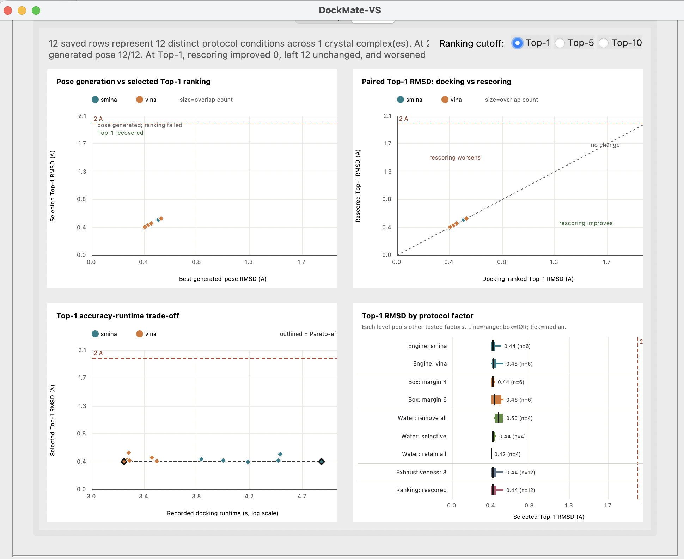

# Examples

The public examples use the DUD-E acetylcholinesterase target (ACES) and the
1E66/HUX co-crystal structure. They demonstrate protocol development followed
by labelled active/decoy screening without presenting DockMate-VS as a new
scoring function.

## ACES protocol development

`dude_aces_protocol_development_1E66.xlsx` contains the native 1E66/HUX
pose-recovery control. `campaign.protocol.yml` evaluates 24 conditions:

- Smina with Vina docking scores;
- 4 A and 6 A co-crystal box margins;
- remove-all, retain-all, and selective water handling;
- exhaustiveness 8 and 16;
- original Vina ranking and Vinardo score-only rescoring;
- seed 42, 20 modes, and at most two tautomers and conformers.

Run locally or with the core container:

```bash
dockmate-vs protocol --config examples/campaign.protocol.yml
scripts/dockmate-docker protocol examples/campaign.protocol.yml
```

The run writes to `results/dude_aces_protocol/`. Use the Summary and Charts
tabs to compare pose recovery, ranking, runtime, and protocol-factor effects.
The chart selector switches all four plots between Top-1, Top-5, and Top-10.
The summary can retain several near-equivalent pose-recovery candidates rather
than choosing a winner from negligible RMSD differences. Compare those
candidates in separate labelled enrichment runs; do not pool their scores into
one AUC.

### Example protocol-development charts



This illustrative GUI result is from a reduced 12-condition repeat of the ACES
workflow using exhaustiveness 8: two engines, two box margins, three water
treatments, and Vinardo score-only rescoring. All conditions recovered the
native pose below 2 A. Because most conditions returned fewer than five
non-redundant poses, the Top-5 and Top-10 views should not be interpreted as
independent evidence of ranking performance. The bundled configuration also
tests exhaustiveness 16 and therefore evaluates 24 conditions.

## ACES screening benchmark

`dude_aces_screening_subset_1E66_seed42.xlsx` contains 20 clustered DUD-E ACES
actives and 200 DUD-E property-matched decoys. The compounds were selected with
a fixed random seed before docking and were not selected using DockMate-VS
scores. All compounds share the 1E66 receptor and HUX-defined site, so the GUI
recognizes this as a single-receptor assay benchmark and displays ROC,
precision-recall, score-distribution, and cumulative-recovery charts.

Run locally or with the core container:

```bash
dockmate-vs screen --config examples/campaign.screen.yml
scripts/dockmate-docker screen examples/campaign.screen.yml
```

The frozen example uses AutoDock Vina with Vina scoring, a 4 A co-crystal
margin, selective crystallographic-water retention, exhaustiveness 8, 20
requested modes, seed 42, and thorough score-based selection from at most two
tautomers and two conformers. It writes to `results/dude_aces_screen/`.

A reference execution with Vina 1.2.7 completed all 220 cases and produced ROC
AUC 0.708, average precision 0.190 at an active prevalence of 0.091, LogAUC
9.73, and EF1/5/10% values of 3.67/2.00/2.00. The best active ranked second.
These are descriptive results for one fixed subset and software workflow, not
an independent validation of a scoring function. Exact values may differ on
another supported toolchain, and users should interpret their generated
manifest and raw result table rather than treating these numbers as acceptance
thresholds.

## Source and interpretation

- Target page: <https://dude.docking.org/targets/aces>
- DUD-E publication: <https://doi.org/10.1021/jm300687e>
- Receptor structure: <https://www.rcsb.org/structure/1E66>
- Rebuild command: `python scripts/prepare_dude_aces_examples.py`

The workbook Metadata sheets record source checksums, selection parameters,
label semantics, and interpretation limits. DUD-E matched decoys are
physicochemically matched, topologically dissimilar presumed non-binders; they
are not experimentally confirmed inactive compounds. This compact subset is a
reproducible software-workflow example rather than a definitive assessment of
Vina, Smina, Vinardo, DUD-E, or ACES virtual-screening performance.

Scores and exact poses can vary with docking-engine version, dependency builds,
protein preparation, CPU architecture, and random seed. The generated run
manifest records the local execution environment. The screening condition was
chosen after pose-recovery protocol development; the enrichment result is a
single illustrative evaluation on the fixed public subset and was not used to
train or modify DockMate-VS.
